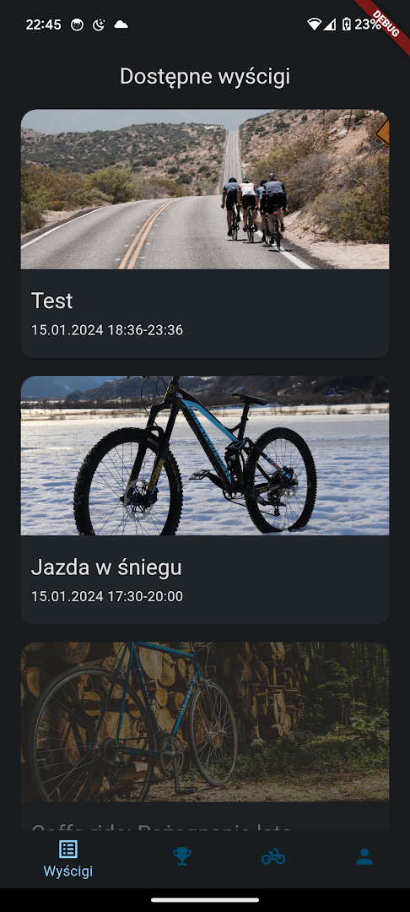
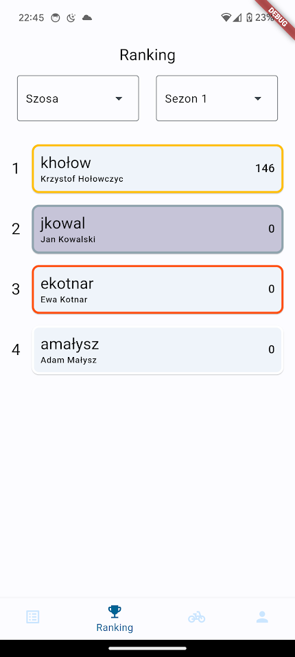
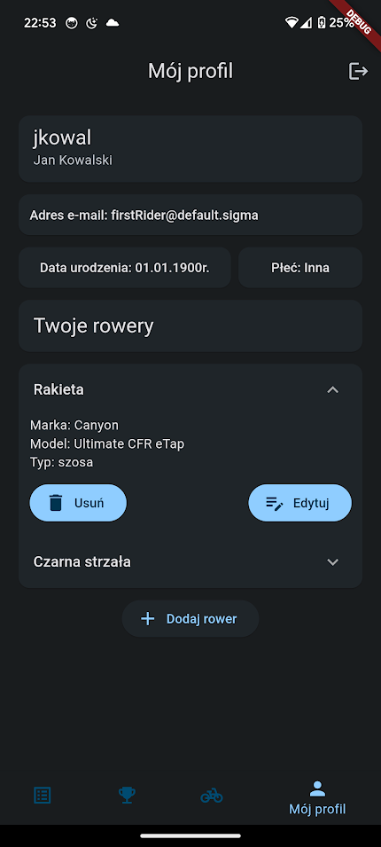
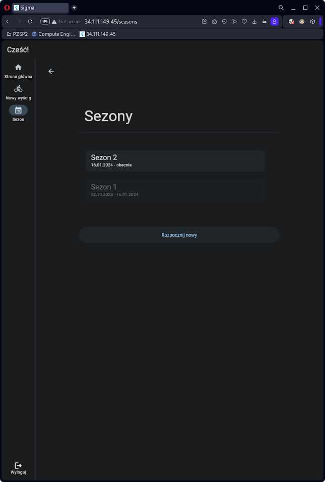

# Bicycle league racing


<details>
  <summary><b>Table of contents</b></summary>

Table of Contents
=================

* [Bicycle league  racing](#bicycle-league-racing)
* [Table of contents](#table-of-contents)
   * [About the project](#about-the-project)
      * [SIGMACATS team](#sigmacats-team)
   * [Built with](#built-with)
   * [Full functionality](#full-functionality)
   * [Standard usage flow](#standard-usage-flow)
   * [Screenshots](#screenshots)
   * [Getting started](#getting-started)
      * [Prerequisites](#prerequisites)
      * [Setup](#setup)
      * [Run](#run)
      * [Run tests](#run-tests)
   * [Try it out](#try-it-out)
   * [Default configuration](#default-configuration)

</details>

## About the project

The aim of the project was to create a system supporting organization and conducting casual bicycle races. The result app is an all-in-one tool for publishing race events by race organizers, registering riders for races, tracking race progress and previewing results. Key project functionalities include

- Allowing race organizers to plan and publish race events, specify track in GPX file, add metadata such as start/end timestamp, event graphic, sponsor banners, scoring rules, etc.
- Allowing riders to participate in races - register for the race and track rider location, which will later be sent to server
- Create multiple classifications on race and season level (general, road/fixie bikes, male/female)
- For more, check [full functionality](#full-functionality) section

The project consists of three components:

- Backend server written in Python with FastAPI
- Flutter web app for race coordinators (mobile-friendly)
- Flutter mobile app (Android & iOS) for participating in races


This is the main project repository - it contains container configs, startup scripts, etc. For actual code, visit other
repositories:

| Repo    | URL                                                               |
|---------|-------------------------------------------------------------------|
| Backend | [sigmacats-backend](https://github.com/SNURTEL/sigmacats-backend) |
| Web     | [sigmacats-web](https://github.com/SNURTEL/sigmacats-web)         |
| Mobile  | [sigmacats-mobile](https://github.com/SNURTEL/sigmacats-mobile)   |

#### SIGMACATS team:

- @jjozwiak113
- @Mewash1
- @SNURTEL
- @avvris


## Built with

            

## Full functionality

- Rider:
    - Browse available races
    - Register for a race with specific bike
    - Track location during the race & send to server after the ride ends
    - Browse race ranking and classifications in specific season
    - Create & edit multiple bikes
    - Account functionality: create account, reset password by email, etc.
- Coordinator:
    - Publish a race event:
        - Specify details: name, description, (optional) requirements, event graphic, GPX route, no. laps, (optional)
          entry fee, start / end time, (optional) meetup time, scoring rules, (optional) sponsor banners
    - Approve / reject riders for participating in a specific race
    - Automatically assign places in race ranking after race end
    - Preview each rider's GPX
    - Override generated ranking before publishing, add point multipliers for bad weather conditions
    - Automatically score rider points in all classifications depending on places taken
    - Create different seasons

## Standard usage flow

- Coordinator creates a race event using the web app

    - Files (GPX, graphics) are uploaded to server using nginx-upload module
    - A Celery task is scheduled to set race status to `in_progress` on race start time
- Rider sees the race and registers for participation

    - Specific bike must be chosen
- Rider goes to race location, coordinator checks if rider fulfils race requirements and approves / rejects the
  participation
- Race starts (Celery sets status to `in_progress`)
- Rider starts tracking the race in mobile app
- After the rider has finished, rider stops tracking location and the GPX is sent to server
  - Server schedules a Celery task for interpolating the timestamp of passing the finish line on the final lap from gpx
- After the last rider has finished, places are assigned to riders based on ride end timestamps
- Coordinator checks if assigned places look OK
  - Places can also be re-ordered, extra points can be assigned to all riders in case of bad weather conditions
- Coordinator accepts the results
- A Celery task recalculates current season's rankings
- Results are published
- Rider sees the race ranking & updated season classifications

## Screenshots

<p float="left">
  
  
  
  
</p>
<p float="left">
  
  
  
  
</p>
<p float="left">
  
  
  
  
</p>

<p float="left">
  
  
</p>
<p float="left">
  
  
</p>
<p float="left">
  
  
</p>
<p float="left">
  
  
</p>


## Getting started

Get the project up & running in minutes.

### Prerequisites

- Docker Compose to run the containers
    - [Docker](https://docs.docker.com/engine/install/)
    - [Docker compose](https://docs.docker.com/compose/install/)
- An Oracle account to pull the DB container image
    - [Create one here](https://profile.oracle.com/myprofile/account/create-account.jspx)
- A Linux host

### Setup

Clone the repository:

```shell
git clone git@github.com:SNURTEL/23z-pzsp2-sigmacats.git
cd 23z-pzsp2-sigmacats
```

Execute the setup script:

```shell
chmod +x setup.sh
./setup.sh
```

The script will:
- copy the default envfile
- log you in to Oracle Container Image Repository (this step will be skipped if you are logged in already)
- pull git submodules 
- create a default Cloudbeaver config.

Most of the app should be good to go, but you may want to look into `.env` and perform some additional setup - for example, for password reset to work, you will need to specify how to connect to your SMTP server in order to send password reset emails.

When you're done setting things up, build container images:

```shell
docker compose build
```

You can also specify `--build-arg BUILD_ENV=(development|test|production)` to use a specific
build config.

### Run

Start the app:

```shell
docker compose up [--detach]
```

On the first startup, backend will set up the DB and insert the initial data. Dummy accounts will also be created according to details specified in `.env`.

After you see the Uvicorn server is running - well done, the app should be good to go! Visit `localhost` and you should see the app's login screen. You can log in using the default credentials and start using the app.


### Run tests

Backend unit test can be started on a running container:

```shell
docker compose up --detach
docker exec fastapi-backend "pytest"
```


## Try it out

- Coordinator web app runs at [port 80](http://localhost)
- Interactive Swagger docs are available at [/api/docs](http://localhost/api/docs)
- Cloudbeaver is available at [/cloudbeaver](http://localhost/cloudbeaver), two connections (admin and user) are already pre-configured. Use default credentials to log in.
- Celery worker is running by default and talking to Redis message broker. To verify this, visit Flower at [/flower](http://localhost/flower) to see worker, task queue, and broker details.

At this point, you should probably visit [sigmacats-mobile](https://github.com/SNURTEL/sigmacats-mobile) and learn how to set up & build the mobile app configured for your backend.


## Default configuration

Default config is stored in `.env.sample`. Default credentials included:

| Type                      | Username                    | Password         |
|---------------------------|-----------------------------|------------------|
| Dummy rider account 1     | `firstrider@default.sigma`  | `rider123`       |
| Dummy rider account 2     | `secondrider@default.sigma` | `rider123`       |
| Dummy coordinator account | `coordinator@default.sigma` | `coordinator123` |
| Dummy admin account       | `admin@default.sigma`       | `admin123`       |
| Oracle DB admin           | `system`                    | `oracle`         |
| Oracle user               | `user1`                     | `user1`          |
| Cloudbeaver admin         | `rootbeaver`                | `cloudbeaver`    |

**In you're running in production, remember to change those!**
